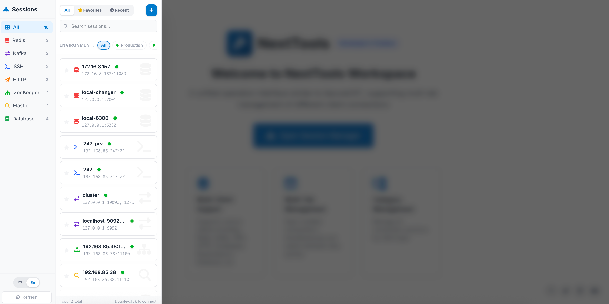
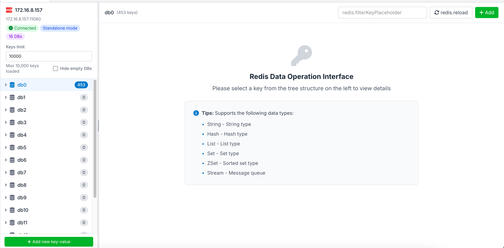
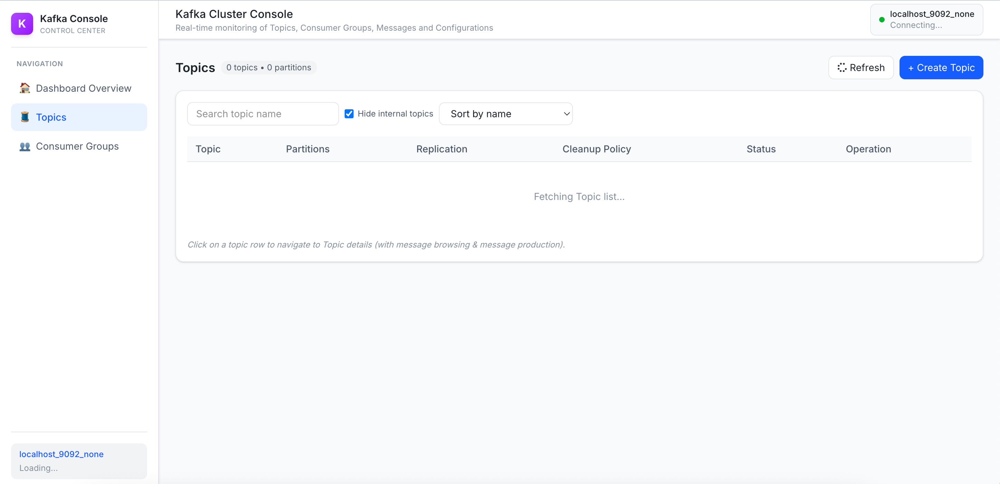
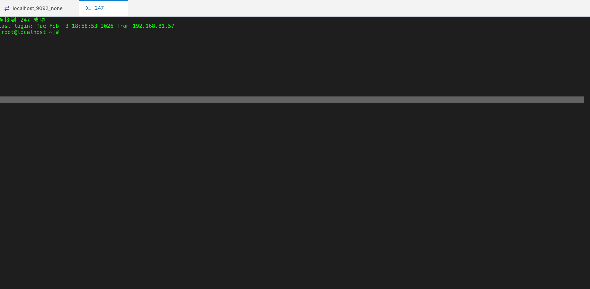
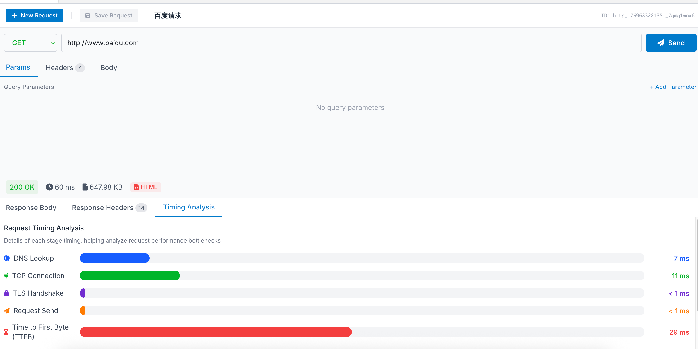
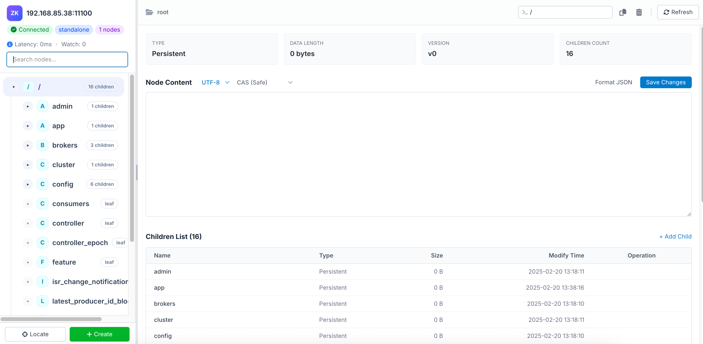
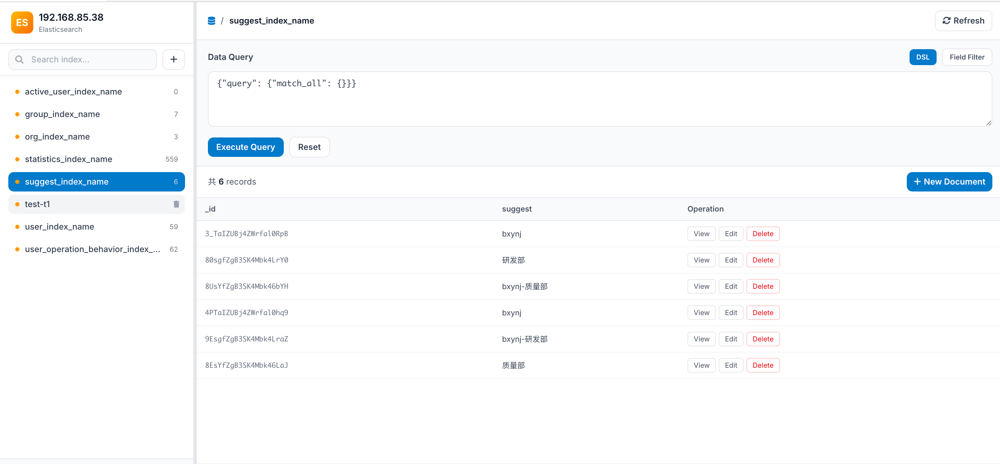
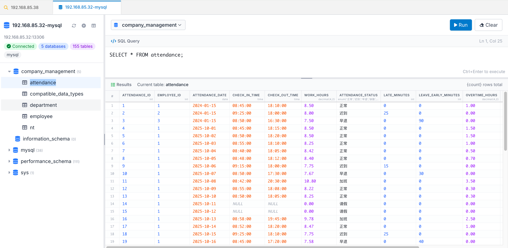

A daily tool for programmers.

[English Version](./README.md) | [中文版本](./README_zh.md)

## About This Project

NextTools is a tool designed for programmers' daily use, aiming to connect common but scattered tasks together to make the usage process simpler and more intuitive.

During the implementation, I used technology stacks such as **React, Node.js, Next.js**, which are tools I have actually used in my long-term work. This project doesn't pursue "showing off skills", but rather focuses on stability, clarity, and maintainability.

It may not be perfect and there's still much room for improvement, but at least it's a project that I'm willing to open every day and continue to maintain.

## Project Overview

NextTools is a toolkit for programmers' daily use, designed to integrate common scattered tasks into a unified platform, making the usage process simpler and more intuitive. The project is built on technology stacks such as React, Node.js, and Next.js, adopting a modern front-end and back-end separation architecture.

## Overall Technical Architecture

### Frontend Architecture

- **Framework**: Next.js 16.0.10 (App Router)
- **Language**: TypeScript
- **UI Component Library**: React 19.2.1, React DOM 19.2.1
- **Styling**: Tailwind CSS
- **State Management**: Local component state + Context API
- **Internationalization**: i18n internationalization support (Chinese, English)

### Backend Architecture

- **Runtime**: Node.js
- **Web Framework**: Next.js API Routes
- **WebSocket**: ws library for real-time communication
- **Database**: SQLite (Better-SQLite3) for storing connection configurations
- **Server**: Custom Node.js HTTP server

### Desktop Application Packaging

- **Framework**: Electron 28.0.0
- **Packaging Tool**: electron-builder

## Detailed Module Functions

### 1. Redis Module

**Implemented Functions**:
- Redis server connection management (standalone, cluster mode)
- Connection testing and validation
- Database browsing (support for multiple DBs)
- Key-value operations (CRUD)
- Support for multiple data types (String, Hash, List, Set, ZSet)
- Key search and filtering
- Persistent storage of connection configurations

**Technical Implementation**:
- Using ioredis library for Redis operations
- Support for password authentication, SSL encrypted connections
- Support for cluster mode connections
- Storing connection configurations through SQLite database

### 2. Kafka Module

**Implemented Functions**:
- Kafka cluster connection management
- Topic management (create, delete, view)
- Message browser (view partitions, message content)
- Consumer Group management
- Cluster metrics monitoring (Broker information, Topic count, partition information)
- Message sending function
- Consumption lag monitoring

**Technical Implementation**:
- Using kafkajs library for Kafka operations
- Support for SSL/SASL security protocols
- Support for multi-Broker cluster connections
- Real-time message consumption through WebSocket

### 3. SSH Module

**Implemented Functions**:
- SSH connection management (support for password and key authentication)
- Web terminal emulator (based on xterm.js)
- SFTP file transfer function
- Persistent storage of connection configurations
- Terminal font, color and other personalized settings
- Connection testing function

**Technical Implementation**:
- Using ssh2 library for SSH connections
- Using @xterm/xterm and @xterm/addon-fit to implement Web terminal
- Bidirectional communication between terminal and server through WebSocket
- Support for both password and private key authentication methods

### 4. HTTP/Postman Module

**Implemented Functions**:
- HTTP request builder (GET, POST, PUT, DELETE, etc.)
- Request history management
- Request collection management
- Response viewer
- Request parameters, headers, authentication configuration
- Request environment management

**Technical Implementation**:
- Based on native fetch API or similar mechanisms
- Request configurations stored through SQLite database
- Support for multiple authentication methods (Basic, Bearer Token, etc.)
- Support for request/response history records

### 5. ZooKeeper Module

**Implemented Functions**:
- ZooKeeper server connection management (standalone, cluster mode)
- ZNode browsing and management
- Data viewing and editing
- ZNode creation and deletion (support for recursive deletion)
- Cluster metrics monitoring
- Status information viewing

**Technical Implementation**:
- Using node-zookeeper-client library for ZooKeeper operations
- Support for four-letter commands to get server status
- Connection pool management implementation
- Storing connection configurations through SQLite database

### 6. Elasticsearch Module

**Implemented Functions**:
- ES cluster connection management (standalone, cluster mode)
- Index management (create, delete, view)
- Index data browsing
- Cluster health status monitoring
- Index statistics viewing
- Search function

**Technical Implementation**:
- Using @elastic/elasticsearch library for ES operations
- Support for basic authentication and API Key authentication
- Support for SSL connections
- Storing connection configurations through SQLite database

### 7. Database Module

**Implemented Functions**:
- Multiple database connection management (MySQL, PostgreSQL, SQLite)
- Database browsing (view databases, tables, structures)
- SQL query execution
- Table data browsing (pagination)
- Table structure viewing
- Data CRUD operations
- Connection testing function

**Technical Implementation**:
- Using mysql2, pg, better-sqlite3 libraries to support multiple databases
- Database connection cache management implementation
- SQL query parameterization to prevent injection
- Storing connection configurations through SQLite database

## Architecture Features

### Data Persistence
- All connection configurations are stored through SQLite database
- Using Better-SQLite3 as the database engine
- Database file locations:
  - dev: `data/connections.db`
  - macOS: `~/Library/Application Support/NextTools/connections.db`
  - Windows: `%APPDATA%\NextTools\connections.db`
  - Linux: `~/.config/NextTools/connections.db`

### Connection Management
- Each type of connection has a unique ID format (such as redis_xxx, kafka_xxx)
- Serialized storage of connection configurations
- Support for connection favorites and environment tagging

### Real-time Communication
- SSH terminal realizes real-time interaction through WebSocket
- Support for heartbeat mechanism to maintain connection stability
- Message encoding processing

### Security Considerations
- Encryption storage of sensitive information (such as passwords, private keys) (depending on specific implementation)
- Connection timeout and retry mechanisms
- Input parameter validation

## Local Development and Debugging

### Prerequisites
- Node.js (version 20.9.0 or higher recommended)
- npm or yarn package manager
- Git for version control

### Getting Started

1. **Clone the repository**
   ```bash
   git clone <repository-url>
   cd next-tools
   ```

2. **Install dependencies**
   ```bash
   npm install
   ```

3. **Start development server**
   ```bash
   npm run dev
   ```
   This will start the Next.js development server on `http://localhost:3000`

### Development Commands

- **Web Development Mode**: `npm run dev`
  - Starts the Next.js development server
  - Provides hot reloading for frontend changes
  - Runs the custom Node.js server for API routes

- **Electron Development Mode**: `npm run electron:dev`
  - Starts both web server and Electron app simultaneously
  - Automatically opens the desktop application
  - Provides hot reloading for both web and Electron components

- **Code Linting**: `npm run lint`
  - Runs ESLint to check code quality
  - Helps maintain consistent coding standards

### Project Structure Overview

```
next-tools/
├── app/                    # Next.js App Router pages and components
├── electron/              # Electron main process files
├── lib/                   # Shared utility libraries
├── scripts/               # Build and utility scripts
├── i18n/                  # Internationalization files
├── img/                   # Image assets
├── data/                  # SQLite database files (created at runtime)
├── server.js             # Custom Node.js server
└── package.json          # Project dependencies and scripts
```

### Debugging Tips

1. **Frontend Debugging**
   - Use browser DevTools (F12) for React component inspection
   - Enable React DevTools extension for better component debugging
   - Check browser console for JavaScript errors

2. **Backend/API Debugging**
   - Server logs are output to the terminal where you ran `npm run dev`
   - API routes can be tested directly through browser or tools like Postman
   - Check terminal output for database connection issues

3. **Electron Debugging**
   - Use `npm run electron:dev` for development
   - Open Electron DevTools with `Ctrl/Cmd + Shift + I`
   - Main process logs appear in the terminal

4. **Database Debugging**
   - Database file location: `data/connections.db`
   - Use SQLite browser tools to inspect database contents
   - Connection configurations are stored in the `connections` table

### Common Development Scenarios

- **Adding new modules**: Create new API routes in `app/api/` and corresponding frontend components
- **Modifying existing functionality**: Most business logic is in `lib/` directory
- **UI changes**: Modify components in `app/components/`
- **Internationalization**: Update JSON files in `i18n/locales/`

### Troubleshooting

If you encounter issues:
1. Ensure all dependencies are installed: `npm install`
2. Clear Next.js cache: `rm -rf .next`
3. Check Node.js version compatibility
4. Verify port 3000 is available
5. Review error messages in terminal output

## Frontend Interface Layout

- **Home Page**: Function card navigation
- **Workspace**: Integration of all tool modules
- **Responsive Design**: Adaptation to different screen sizes
- **Internationalization**: Support for Chinese and English switching

## Screenshot Showcase

### Main Function Interfaces

<div align="center">

#### Session Management Interface


#### Redis Management Interface


#### Kafka Management Interface


#### SSH Terminal Interface


#### HTTP/Postman Interface


#### ZooKeeper Management Interface


#### Elasticsearch Management Interface


#### Database Management Interface


</div>

---

## Why This Project Deserves a Star ⭐

If you feel that this tool demonstrates some understanding of programmers' daily work in its design and implementation;
If you认同 that kind of approach that doesn't chase trends or pile up concepts, but simply gets things done solidly;
Then a Star is already the best encouragement for this project.

---

## About Me

I have undertaken architecture-related work in companies, with relatively complete practical experience in system design, service splitting, and engineering.

The languages I use daily include **Golang, Python**, and I also continuously follow and learn about **AI-related directions**, more from the perspective of engineering implementation and practical application.

I'm not good at packaging myself, nor do I like to exaggerate technical abilities. What I can be sure of is:

- Habit of completing things thoroughly
- Clear problem-solving
- Long-term responsibility for code and systems

If you're looking for a programmer who can **work remotely**, feel free to contact me via email:

📧 **calvinliuki@gmail.com**

It doesn't have to lead to results - chatting about projects, technology, or ideas is also welcome.

---

## Finally

Open source is not a pose for me, but a choice.

By releasing this project, I hope it can go further than I can.

If you're willing to use it, provide feedback, or improve it together, I would be very grateful.